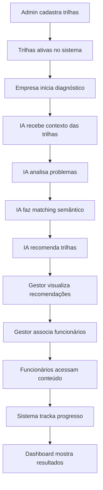

# 🎯 Sistema de Trilhas - Implementação Completa

## ✅ TUDO QUE FOI CRIADO

### 📦 Backend (Banco de Dados & APIs)

#### 1. Model Trilha (`src/models/Trilha.ts`)
✅ Schema Mongoose completo com:
- Informações básicas (nome, descrição, nível, duração, status)
- Tags semânticas para IA
- Áreas abordadas
- Objetivos de aprendizagem
- Módulos (vídeo, podcast, texto, avaliação, atividade)
- Metadados para recomendação pela IA
- Estatísticas de uso
- Índices para busca otimizada

#### 2. APIs REST Completas (`src/app/api/trilhas/`)
✅ 7 Endpoints criados:

1. **GET /api/trilhas** - Listar todas com filtros opcionais
2. **POST /api/trilhas** - Criar nova trilha
3. **GET /api/trilhas/[id]** - Buscar trilha específica
4. **PUT /api/trilhas/[id]** - Atualizar trilha
5. **DELETE /api/trilhas/[id]** - Deletar trilha
6. **GET /api/trilhas/tags** - Listar todas tags únicas
7. **POST /api/trilhas/seed** - Popular 6 trilhas mock

### 🎨 Frontend (Interface Admin)

#### 1. Página de Listagem (`/admin/trilhas/page.tsx`)
✅ Recursos implementados:
- Cards visuais com informações principais
- Busca em tempo real (nome, descrição, tags)
- Filtros por status (ativa/inativa/rascunho)
- Filtros por nível (Iniciante/Intermediário/Avançado)
- Preview detalhado em modal
- Estatísticas de uso
- Botão de popular trilhas mock
- Botão de criar nova trilha
- Botões de editar e deletar
- Confirmação de exclusão
- Loading states
- Empty states

#### 2. Página de Cadastro (`/admin/trilhas/nova/page.tsx`)
✅ Formulário completo com:
- Informações básicas (nome, descrição, duração, nível, status)
- Tags semânticas (com explicação)
- Áreas abordadas
- Objetivos de aprendizagem (um por linha)
- Metadados para IA:
  - Problemas relacionados
  - Competências desenvolvidas
  - Resultados esperados
- Sistema de módulos dinâmico:
  - Adicionar/remover módulos
  - Reordenação automática
  - 5 tipos de conteúdo
  - Campos específicos por tipo
- Validações
- Botões de salvar e cancelar

#### 3. Página de Edição (`/admin/trilhas/[id]/page.tsx`)
✅ Mesma estrutura do cadastro, com dados pré-carregados

### 📚 6 Trilhas Mock Prontas

✅ Trilhas completas com módulos reais:

**1. Liderança Transformadora** (Intermediário, 20h)
- 4 módulos (vídeo, podcast, avaliação)
- Tags: liderança, gestão, comunicação, tomada-de-decisão
- Resolve: baixa-produtividade, falta-de-liderança, conflitos

**2. Cultura Organizacional e Engajamento** (Intermediário, 15h)
- 4 módulos (vídeo, texto, atividade prática)
- Tags: cultura-organizacional, engajamento, valores
- Resolve: baixo-engajamento, alta-rotatividade, clima-ruim

**3. Inovação e Criatividade Corporativa** (Avançado, 18h)
- 4 módulos (vídeo, atividade, podcast)
- Tags: inovação, design-thinking, metodologias-ágeis
- Resolve: falta-de-inovação, processos-obsoletos, estagnação

**4. Comunicação Corporativa Efetiva** (Iniciante, 12h)
- 4 módulos (vídeo, texto, avaliação)
- Tags: comunicação, apresentações, negociação
- Resolve: comunicação-ineficaz, ruídos, conflitos

**5. Gestão de Performance e Resultados** (Intermediário, 16h)
- 4 módulos (vídeo, atividade prática)
- Tags: gestão-performance, kpis, metas, produtividade
- Resolve: baixa-produtividade, falta-de-metas, desempenho-baixo

**6. Diversidade e Inclusão** (Iniciante, 10h)
- 4 módulos (vídeo, texto, avaliação)
- Tags: diversidade, inclusão, equidade, viés-inconsciente
- Resolve: falta-diversidade, ambiente-exclusivo, discriminação

### 📖 Documentação Completa

✅ 4 Documentos criados:

1. **RESUMO-EXECUTIVO.md** - Este arquivo (visão geral)
2. **README-SISTEMA-TRILHAS.md** - Documentação completa do sistema
3. **INTEGRACAO_TRILHAS_IA.md** - Guia de integração com IA
4. **estrutura-trilhas-exemplo.json** - Exemplos JSON completos

### 🧩 Componentes UI

✅ Componente criado:
- `textarea.tsx` - Campo de texto multilinha

## 🚀 COMO COMEÇAR A USAR

### Passo 1: Popular Trilhas Mock

```bash
# Opção A: Via Interface
1. Acesse http://localhost:3000/admin/trilhas
2. Clique no botão "Popular Trilhas Mock"
3. Aguarde confirmação

# Opção B: Via API
curl -X POST http://localhost:3000/api/trilhas/seed
```

### Passo 2: Explorar Trilhas

```bash
# Acessar listagem
http://localhost:3000/admin/trilhas

# Usar filtros e busca
# Visualizar detalhes clicando nos cards
# Editar ou deletar trilhas
```

### Passo 3: Criar Trilha Personalizada

```bash
1. Clicar em "Nova Trilha"
2. Preencher todos os campos
3. Adicionar módulos (mínimo 1)
4. Definir tags semânticas
5. Salvar
```

## 🔗 INTEGRAÇÃO COM IA (Próximo Passo)

### Onde integrar:
`src/app/diagnostico-aprofundado/page.tsx`

### O que fazer:

#### 1. Carregar trilhas disponíveis
```typescript
const [trilhasDisponiveis, setTrilhasDisponiveis] = useState([]);

useEffect(() => {
  async function carregarTrilhas() {
    const res = await fetch('/api/trilhas?status=ativa');
    const { trilhas } = await res.json();
    setTrilhasDisponiveis(trilhas);
  }
  carregarTrilhas();
}, []);
```

#### 2. Incluir no prompt da IA
```typescript
const systemPrompt = `
Você é um consultor especializado...

TRILHAS DE APRENDIZAGEM DISPONÍVEIS:
${trilhasDisponiveis.map(t => `
- ID: ${t._id}
- Nome: ${t.nome}
- Tags: ${t.tags.join(', ')}
- Problemas que resolve: ${t.metadados.problemasRelacionados.join(', ')}
`).join('\n')}

IMPORTANTE: Ao final do diagnóstico, recomende trilhas baseado nos problemas identificados.
Use matching semântico entre problemas e as tags/problemasRelacionados das trilhas.
`;
```

#### 3. Solicitar recomendações no relatório final
```typescript
const finalPrompt = `
Gere relatório incluindo campo "trilhasRecomendadas" com:
- trilhaId (usar os IDs fornecidos)
- nomeTrilha
- prioridade (alta/média/baixa)
- motivo (por que foi recomendada)
- problemasQueResolve
- areasRelacionadas
`;
```

#### 4. Processar e exibir resultados
Na página de resultados, buscar detalhes completos das trilhas e exibir para o gestor.

## 📊 FLUXO COMPLETO DO SISTEMA



## 🎯 MATCHING SEMÂNTICO

### Como funciona:

**Problema identificado pela IA:**
```
"Baixa produtividade e desmotivação da equipe"
```

**Trilhas que fazem match:**

1. **Liderança Transformadora** (Match ALTO)
   - Tags: liderança, gestão, comunicação
   - Problemas: baixa-produtividade, baixo-engajamento, falta-de-liderança
   - Match: 2 tags diretas ✅

2. **Gestão de Performance** (Match ALTO)
   - Tags: gestão-performance, kpis, produtividade
   - Problemas: baixa-produtividade, desempenho-baixo
   - Match: 1 tag exata ✅

3. **Cultura e Engajamento** (Match MÉDIO)
   - Tags: engajamento, cultura-organizacional
   - Problemas: baixo-engajamento, desmotivação
   - Match: 1 tag relacionada ⚠️

**Recomendação da IA:**
```json
{
  "trilhasRecomendadas": [
    {
      "trilhaId": "abc123",
      "nomeTrilha": "Liderança Transformadora",
      "prioridade": "alta",
      "motivo": "Aborda diretamente baixa produtividade e engajamento"
    }
  ]
}
```

## 📁 ESTRUTURA DE ARQUIVOS CRIADOS

```
EchoNova/
└── app/
    ├── src/
    │   ├── models/
    │   │   └── Trilha.ts                          ✅ NOVO
    │   ├── components/
    │   │   └── ui/
    │   │       └── textarea.tsx                   ✅ NOVO
    │   └── app/
    │       ├── api/
    │       │   └── trilhas/
    │       │       ├── route.ts                   ✅ NOVO (GET/POST)
    │       │       ├── [id]/
    │       │       │   └── route.ts              ✅ NOVO (GET/PUT/DELETE)
    │       │       ├── tags/
    │       │       │   └── route.ts              ✅ NOVO (GET tags)
    │       │       └── seed/
    │       │           └── route.ts              ✅ NOVO (POST seed)
    │       └── admin/
    │           └── trilhas/
    │               ├── page.tsx                   ✅ NOVO (Listagem)
    │               ├── nova/
    │               │   └── page.tsx              ✅ NOVO (Cadastro)
    │               └── [id]/
    │                   └── page.tsx              ✅ NOVO (Edição)
    └── docs/
        ├── RESUMO-EXECUTIVO.md                    ✅ NOVO (Este arquivo)
        ├── README-SISTEMA-TRILHAS.md             ✅ NOVO
        ├── INTEGRACAO_TRILHAS_IA.md              ✅ NOVO
        └── estrutura-trilhas-exemplo.json        ✅ NOVO
```

## 🎨 TIPOS DE MÓDULOS SUPORTADOS

### 1. 📹 Vídeo
- Aulas gravadas, webinars, tutoriais
- Requer: URL do vídeo
- Duração em minutos

### 2. 🎙️ Podcast
- Episódios de áudio, entrevistas
- Requer: URL do áudio
- Duração em minutos

### 3. 📄 Texto
- Artigos, eBooks, guias
- Pode ter: Conteúdo em markdown/HTML
- Duração estimada de leitura

### 4. ✅ Avaliação
- Quizzes, testes, provas
- Sistema de pontuação
- Certificação

### 5. 🛠️ Atividade Prática
- Exercícios, projetos, simulações
- Estudos de caso
- Trabalhos práticos

## 🔐 SISTEMA DE STATUS

### Ativa
✅ Trilha disponível para recomendação pela IA
✅ Visível para gestores
✅ Pode ser atribuída a funcionários

### Inativa
⚠️ Não aparece para IA
⚠️ Mantém dados históricos
⚠️ Pode ser reativada

### Rascunho
📝 Em construção
📝 Não visível para IA
📝 Apenas para admin

## 📊 MÉTRICAS DISPONÍVEIS

Cada trilha possui estatísticas:
- Total de atribuições (quantos funcionários foram associados)
- Total de conclusões (quantos completaram)
- Avaliação média (feedback dos usuários)

## 🎯 TAGS RECOMENDADAS

### Tags Gerais (Conceitos amplos)
- liderança, gestão, comunicação
- inovação, criatividade, estratégia
- tecnologia, digital, transformação

### Problemas Específicos (Keywords)
- baixa-produtividade, conflitos-internos
- falta-de-inovação, comunicação-ineficaz
- alta-rotatividade, baixo-engajamento

### Competências (Habilidades)
- Tomada de Decisão, Gestão de Conflitos
- Pensamento Crítico, Inteligência Emocional
- Análise de Dados, Gestão de Projetos

## 🚦 STATUS DA IMPLEMENTAÇÃO

### ✅ CONCLUÍDO
- [x] Model de dados
- [x] APIs REST completas
- [x] Interface admin (listagem)
- [x] Interface admin (cadastro)
- [x] Interface admin (edição)
- [x] 6 Trilhas mock
- [x] Componente Textarea
- [x] Documentação completa
- [x] Exemplos JSON

### ⏳ PRÓXIMOS PASSOS (Para você)
- [ ] Integrar no prompt da IA
- [ ] Atualizar schema DiagnosticoAprofundado
- [ ] Exibir trilhas nos resultados
- [ ] Sistema de associação funcionário-trilha
- [ ] Tracking de progresso
- [ ] Dashboard de acompanhamento

## 🎓 EXEMPLO PRÁTICO DE USO

### Cenário Real:

**1. Diagnóstico identifica:**
- Problema: "Gestores sobrecarregados, não delegam"
- Problema: "Comunicação verticalizada"
- Problema: "Equipe desmotivada"

**2. IA analisa trilhas e recomenda:**

🏆 **Alta Prioridade:**
- Liderança Transformadora (resolve 3 problemas)

⭐ **Média Prioridade:**
- Comunicação Corporativa (resolve 1 problema)
- Cultura e Engajamento (resolve 1 problema)

**3. Gestor visualiza recomendações:**
- Vê detalhes de cada trilha
- Lê justificativas da IA
- Decide quais implementar

**4. Gestor associa funcionários:**
- Seleciona gestores para "Liderança Transformadora"
- Define prazo: 60 dias
- Define observações

**5. Sistema acompanha:**
- Funcionários acessam conteúdo
- Completam módulos
- Fazem avaliações
- Dashboard mostra progresso

## 📞 SUPORTE E DOCUMENTAÇÃO

### Documentos Criados:
1. **RESUMO-EXECUTIVO.md** ← Você está aqui
2. **README-SISTEMA-TRILHAS.md** - Documentação técnica completa
3. **INTEGRACAO_TRILHAS_IA.md** - Guia passo a passo de integração
4. **estrutura-trilhas-exemplo.json** - Exemplos práticos

### Onde encontrar ajuda:
- Código comentado nos arquivos
- Exemplos JSON no docs/
- Trilhas mock como referência

## ✨ DIFERENCIAIS DO SISTEMA

1. **Matching Semântico Inteligente** - IA recomenda baseada em análise real
2. **Tags Multi-nível** - Tags gerais + problemas específicos + competências
3. **Flexibilidade de Conteúdo** - 5 tipos diferentes de módulos
4. **Interface Intuitiva** - Admin fácil de usar
5. **Sistema Escalável** - Preparado para crescer
6. **Estatísticas Integradas** - Métricas desde o início
7. **Trilhas Mock Prontas** - Comece usando imediatamente

---

## 🎉 SISTEMA 100% PRONTO PARA USO!

**Comece agora:**
1. Acesse `/admin/trilhas`
2. Clique em "Popular Trilhas Mock"
3. Explore as 6 trilhas criadas
4. Teste criando uma trilha personalizada
5. Siga a documentação de integração com IA

**Sucesso! 🚀**
